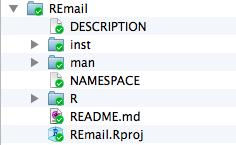
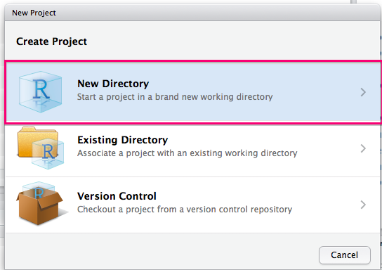
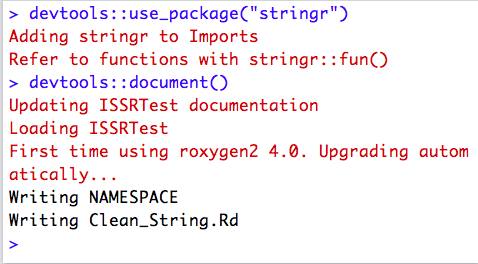
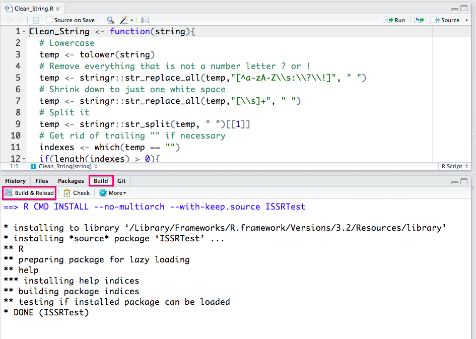

# Developing Your First R Package

## Overview

An R package is a nice tidy way to reuse and share functions you have created. Most packages fall into one of three different categories:

* **Packages that have some specific topical function**: This would include packages like readXL or scrapeR that are designed with a number of functions to do one sort of thing (read in files and scrape files off the web respectively). These kinds of packages also often accompany publications about new statistical techniquesand provide a way for other people to use the method. Almost always available on CRAN.
* **Utility Packages**: These packages might do lots of general stuff like igraph or MCMCpack which provide lots of utility functions for dealing with networks and MCMC inference respectively. Almost always available on CRAN.
* **Personal Packages**: There are some packages that just have a bunch of random functions somebody wrote that they find useful. These are mostly restricted to Github in terms of distribution. 

Developing a [personal package](http://hilaryparker.com/2013/04/03/personal-r-packages/) is a really good place to start, so that is what we will focus on in this tutorial. We will work to put a simple personal package up on Github and make it so you can download it on another computer and have it work. There are a ton of tutorials out there so I will focus on the things I had to figure out for myself, including how to incorporate C++ and python code into a package. 

### The Tutorials I Used 

As I mentioned above, there are a ton of good tutorials out there for developing your own R package. Here are just a few you should check out. 

* I started with this [great blog post by Hillary Parker](http://hilaryparker.com/2014/04/29/writing-an-r-package-from-scratch/) that goes over the minimal number of steps necessary to create a very simple R package and post it to Github 
* Hadley Wickham also wrote a book on R packages, aptly named **R Packages** -- which is also availabe online for free here -- <http://r-pkgs.had.co.nz/>. This was the source I probably used most heavily.
* A nice little blog post on [including Python code in an R package ](http://blog.quantitations.com/tutorial/2012/11/17/including-python-code-in-an-r-package/).
* A little tutorial on [putting your R package on Github](http://kbroman.org/pkg_primer/pages/github.html).
* A must-read short tutorial on [using RStudio for R package development](https://support.rstudio.com/hc/en-us/articles/200486488-Developing-Packages-with-RStudio).
* The Bible -- [Writing R Extensions](http://cran.r-project.org/doc/manuals/r-release/R-exts.html) is the most comprehensive reference for R package development. However it is really too detailed for most of what we want to do at this point.

## Getting Started with Dropbox, Github, and RStudio

### How To Structure Your Directory

I have found that the best structure for package development is to put the package directory inside of a `Package_Development` folder which I store on Dropbox. This way I can keep scratch files associated with package development in one place. I also suggest creating a repo for your package and uploading it to Github so you can download it. However, to make it easy for you and others to download your package from Github, you will only want to include the package directory itself in your repo, and not the `Package_Development` folder. To make sure that you do not lose any of your associated files in this folder, I suggest you keep it in your Dropbox. Here is a screenshot for the file structure of an example package I am developing:  
  
  

  
  
  
Alternatively, you can just have the package as a stand alone directory as in the following example if you do not anticipate needing lots of scratch files or have some other place to put them, as in the following example:  
  
  

### Creating A Package In RStudio

To create a package in RStudio, you will want to check out [this tutorial](https://support.rstudio.com/hc/en-us/articles/200486488-Developing-Packages-with-RStudio) and then follow the steps outlined below. First you will want to install the `devtools` library as it will make you life way easier!

	install.packages("devtools")

Next, you will want to click on the projects tab and select **New Project**: 
  
  
  
  
  
You will then want to select **New Directory**:   

  
   
 
       
You should then selecte **R Package**:  
  
    
  
  
    
You will then need to choose a name for your package and select a directory to create it as a subdirectory of. You should also check the box to create a Git repo.    

  
  
  
  
You can now remove the example function (just delete the R file) and start to add functions to the R subdirectory. I am adding a `Clean_String.R` function (detailed in the next subsection) in this example: 
  

  
  
  
Now you can go and select **Add** in your Github client and then navigate to the package directory, make your initial commit and publish your R package skeleton!  
  
 
   
  
  
Now it is time to edit the `DESCRIPTION` file and fill it in with some more informative text as in the following example:  
  
  
  
  
  
You will then want to make sure you properly document all functions you want to make visible to package users (described in detail below in the **Documenting** subsection). You will then be able to use the `devtools::document()`  function to automatically generate help files for each of these functions and the `devtools::use_package()` function to make any packages your functions relies on dependencies of your package.  
  
  
  
  
  
You can now go Ahead and click on  the **Build** tab in RStudio and then on the **Build and Reload** button in this tab and R will build your package!
  
    
  

  
You will now notice that more files have been added to the package directory (The help files for your functions).  
  
  
    
	  
	   
You should now be able to access your package on your local machine by using the standard  `library(mypackage)`  command. You are cooking with gas! The next step is to upload your updated package to Github. If all went well, other people will be able to download and install your package by first installing `devtools` and then running the following command:

	devtools::install_github("yourGithubUsername/yourPackageName")
	
Its that simple. Give it a try, then start iterating. The sky is literally the limit. 
## Your First Function
For our first function, we will just define a simple string cleaning function that takes a messy string and tokenizes it

	Clean_String <- function(str){
	  # Lowercase
	  temp <- tolower(str)
	  # Remove everything that is not a number letter ? or !
	  temp <- stringr::str_replace_all(temp,"[^a-zA-Z\\s]", " ")
	  # Shrink down to just one white space
	  temp <- stringr::str_replace_all(temp,"[\\s]+", " ")
	  # Split it
	  temp <- stringr::str_split(temp, " ")[[1]]
	  # Get rid of trailing "" if necessary
	  indexes <- which(temp == "")
	  if(length(indexes) > 0){
	    temp <- temp[-indexes]
	  }
	  return(temp)
	}

## Dependencies
If the functions we want to use require access to any other packages, we can make sure that they are added as dependencies (which will be automatically downloaded with the package) by running the following line of code for each package we want to require (with the appropriate package name inserted):

	devtools::use_package("stringr")

Note that the best way to access the functionality these packages provide is to explicitly reference their sub-functions when we need them instead of loading the whole pakage as in the following example:

	stringr::str_replace_all(temp,"[^a-zA-Z\\s]", " ")

This can seem tedious at first, but will end up reducing conflicts and making your life easier in the long run.

## Documenting

We can make use of the totally awesome `roxygen2` package to do all of the function documenting for us if we stick to the following commenting format for function definitions in our R source files:

	#' A Function to clean a single input string by removing punctuation and numbers and tokenizing it.
	#' 
	#' @param str A single input string such as "This is a cool function!" 
	#' @return A vector contain all valid tokens in the original input string
	#' @export
	Clean_String <- function(str){
		...

The first line should include a short general description of what the function does. Then for each parameter we can pass in to the function we will want to include an `@param` statment, followed by a space, followed by the parameter name exactly as it appears in our function, followed by a space, followed by a description of what that parameter can be. We may also want to include a `@return` statement telling the user what the function returns. Critically, if we want the user to be able to access the function in R, we will want to inlcude a `@export` on the line directly before the function definition begins. Once we have documented each function we wish the user to have access to in this way (internal functions do not need to be documented), we can then run the following command to generate help files for our functions automatically:

	devtools::document()
	
Following the suggestion in Hadley Wickham's R Packages book, you will also want to include an R file (possibly with the same name as your package -- I prefer to call mine `Package_Documentation.R` -- It does not really matter what you call it) in the `R` folder in your package directory. In this file you can document the whole package itself and not just the individual functions. You can also include other useful statments that will automatically take care of some of the setup for using C++ code (for example) which means you do not have to remeber to do these things by hand. Here is a very basic example of how this could look:

	#' MyPackage: A package for estimating some cool stuff!
	#'
	#' @section MyPackage functions:
	#' Give an overview of your functions here
	#'
	#' @docType package
	#' @name MyPackage
	NULL
	#> NULL

	#' @import methods
	NULL

	#' @useDynLib GERGM
	#' @importFrom Rcpp sourceCpp
	NULL

Note that they last three lines are necessary if you want to include C++ code in your package, and the `@import methods` statement is necessary if you want to create your own object class. 

## Adding In C++ Code

If you are going to use C++ code in your R package, the first thing you will need to do is make sure your `DESCRIPTION` and `NAMESPACE` files are set up correctly. For the `NAMESPACE` file, you will want to make sure you add the following lines at the end of your file where `YourPackageName` is the exact (case sensitive) name of your package. 

	importFrom(Rcpp,evalCpp)
	useDynLib(YourPackageName)
	
You will want to do this ideally after you have documented your package so it will come after the export statements for any functions you wish to make available to users. I usually do this last before I try testing the package. You will also want to make sure you are requiring all of the necessary C++ packages for your particular project. The three main packages I use are `Rcpp`, `RcppArmadillo` and `BH`, so I would run the following lines of code which will update my `DESCRIPTION` file:

	devtools::use_package("Rcpp")
	devtools::use_package("RcppArmadillo")
	devtools::use_package("BH")

You will also want to make sure that any of these that you are using are also linked to, by filling out the `LinkingTo:` field in your `DESCRIPTION` files as follows:

	LinkingTo: 
	  Rcpp, 
	  RcppArmadillo,
	  BH

Thus, for me, the last lines of my `DESCRIPTION` file now look like this:

	Imports: 
	  Rcpp,
	  RcppArmadillo,
	  BH
	LinkingTo: 
	  Rcpp, 
	  RcppArmadillo,
	  BH

## Adding in Python code

## Writing Robust Code

One thing you will definitely want to keep in mind when you are releasing a package into the wild is that your users will (unintentionally) be hell-bent on trying to use your code in ways you did not intend. This will most likely lead to very visible runtime catastrophes where a function breaks or R crashes. These are no fun, but atleast everyone knows that somethign went wrong. The more insidious problem is when the user gives your functions something they do not expect and they quitely go on to produce the wrong output, but in a way that it is hard to tell that somethign went wrong. This can lead people to draw the wrong inferences (very, very bad) or just throw up their hands in frustration if things just do not seem quite right and stop using your package. Fortunately there are several time consuming and slightly tedious things you can do to help your users not screw up, and to help them figure out what went wrong when they do.

### Document Your Code Very Well

While I already mentioned this above, good documentation is your first line of defence against code not working the way it should. Here are a few things I have found to work pretty well:

* **Be verbose** -- write more than you think you need to about each argument to any functions you make availabe to the user and try to really explain things using simpler words and concepts that people who do not have a huge amount of programming experience can understand. I have found this to be a real frustration when learning other languages and people on StackOverflow have answered my question but in words I do not understand. 
* **Give very simple working examples** -- you should seek to give toy examples using your code that cover all relevant use cases, yet are simple enough that it is apparent what is happening. Comment this code as well!
* **Giver very clear names to varaibles** -- this will help your users keep track of what data is supposed to go where. 

### Warnings and Output

Another important way you can help your users out is to provide a lot of warning messages and output that tells them how things are going as your functions run. 

## Example Data

It will often be useful to add example data to your package as this will allow the users to make sure they understand the format your functions want and what their output should look like. Fortunately, this is pretty easy, as the `devtools` package provides a function for adding data to your package and ensuring it is in the right format. The first thing you will want to do is load all of the data objects you want to include with the package in to your R session. Each object should have the name you want it to have when your user sees it, and each object will be stored as a .rda file with the same name in the `./data` directory. You can then add the data by using the following command:

	devtools::use_data(my_data_1,my_data_2, my_data_3)

You can include as many objects as you want, but it is probably a good idea not to include huge datasets as this will make installing your package really slow.
## Distributing Your New Package
