# R, Github, and Remote Access for Data Science Applications

## Overview

This tutorial will provide an overview of using R for complex data management and Data Science tasks and deal with a lot of the setup required to take on bigger projects. I will be making use of RStudio and Github in this tutorial as they provide a lot of useful features and will generally save you time. The overall aporach I have found to work best for large scale, complex, Data Science projects is to use R as the command center, or the glue that holds all the pieces together. R is a good choice for the user facing side of the project because:

* R provides lots of helpful functions and libraries for data management.
* A number of other languages can be easily controlled from, and integrated into R programs (e.g. Bash, C++, Python)
* It is relatively easy to redistribute and extend the code you write for one project by bundling it into a package.
* R provides a nice set of tools for further data analysis and visualization when you have completed data management.
* R projects scale reasonably well -- they make sense on your laptop, but can also run on a cluster without too much trouble.

There will, however, be some applications where R is not the best choice:

* If your project requires a heavy use of natural language processing (NLP), Python offers the best libraries for doing this and may be simpler and easier to use.
* If you will be working with extremely large scale scientific simulations, you should be working directly with a more efficient language such as C, Fortran or C++ (although these can be integrated with R for most projects).
* If you need to do lots of in-memory manipulation of very large datasets (think 10-100+GB on disk), you may want to use a more memory efficient language for everythng.

These tend to be special cases of Data Science tasks, but if you think a project will require some of the above, you are either -- (a) A computer scientist who should not have trouble switching over to some other language, or (b) An ambitious social scientist who should probably go find a computer science collaborator so you do not waste your time on engineering that will not be useful to your career. I have been using the term **Data Science** in this tutorial, but so far I have not defined what I mean by the term, which is what I will do next!

### What is Data Science?

Data Science is a term that gets thrown around a lot in the media these days, it is certainly a hot field even if nobody really knows exactly what it is. To me, **Data Science is more about manipulating your data to get it ready for analysis, and generating useful output, than it is about statistical analysis**. You may be doing some super fancy stats with your data, but the core of what a Data Scientist does is agnostic of what kind of analysis you will be doing. Here are some examples of problems that may require a Data Science approach:

* **Question:** You want to know about patterns of language use by politicians. -- To answer this question you will need to:
0. Determine the population of interest.
1. Collect lots of text data, probably in an unstructured format off of lots of different databased and websites.
2. Organize and process the data into a common format.
3. Extract useful bits of text out of the data and generate a bunch of aggregate level datasets.
4. Analyze your dataset.
* **Question:** You want to be able to rank celebrities by their "influence" on social media.
0. Come up with a list of celebrities.
1. Collect lots of data about celebrities, what they say, and who follows them on a bunch of social media sites. Collect a bunch of data about how they are talked about in the news. 
2. Organize data into a multiplex, text-valued network dataset. 
3. Produce a bunch of different metrics for this dataset that are suitable for further analysis.
4. Analyze your dataset.

I have found that projects like these require you to spend about 95% of your time collecting and preparing your data for analysis, and 5% actually doing the analysis. I have also found that even with very different datasets, I will still end up using the same basic approaches repeatedly. 

## RStudio

RStudio (available for free for non-comercial applications here: <http://www.rstudio.com/>) is an integrated development environment (IDE) for R that makes lots of things easier. I will be outlining a number of things you can do to customize and maximize your use of RStudio below.

RStudio provides a number of extensions and upgrades to the base R user experience, some of which are menu driven. I will go over a few of these below:

1. One of the things you will do most often is set you working directory. This is a way to tell your computer where you want to look for data by default, and where you have stored or want to store output. It is just a folder on your computer and can be set to your My Documents folder, although I suggest you create a separate folder for each project and keep all of the files, data and scripts for the project in that one folder. RStudio provides an easy menu driven way to do this. Note that you have several choices: you can choose to search for the folder if you select **Choose Directory**, or set your working directory to the folder that contains the R script file you are working on (only works if the script has already been saved and is in a folder where you have your data/want your output to go) if you select **To Source File Location**. This will also print the R command to your console pane, and then you can copy it into your script file so that you do not have to keep searching for the folder every time you open R but instead can just enter the one line R command that sets your working directory.  

 

2. Under the code tab, R also has a handy functionality to comment or un-comment a block of code. This will come in handy if you discover that some of your code is incorrect or you just want to save it but make sure you do not run it by accident and do not want to comment the lines by hand.  
  
 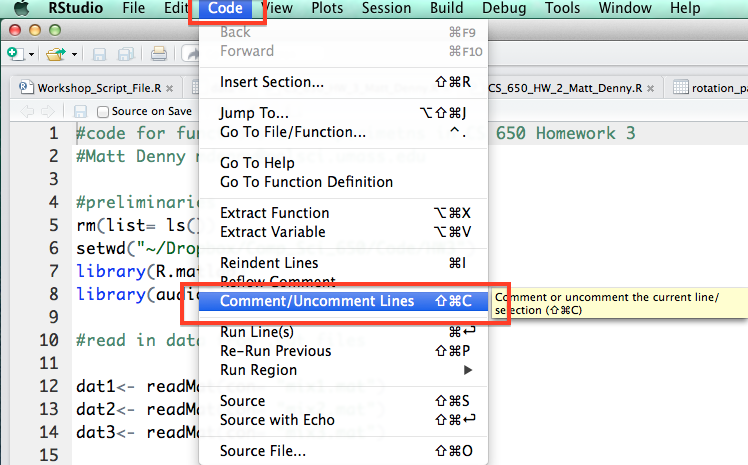

3. Perhaps the most important menu item in RStudio is the button that takes you to the **Global Options** for RStudio. From this menu, you will be able to change the overall appearance and functionality of R and RStudio.  

 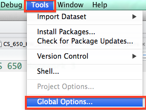

4. One of the most relevant things you may want to do is change the window layout in RStudio. As you may notice in the workshop, I have my windows set up a different way from the default. You can change the layout on your computer by clicking to **Pane Layout** tab and checking the boxes as they are in the picture below:  
  
  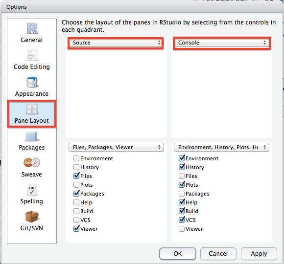

5. There are another couple of options I highly suggest you change from their default values by clicking through to the **Code Editing** tab in the options window. I strongly suggest you check the box to **soft-wrap R source files** as this will make very long lines of R code wrap around to the next line so you do not have to keep side scrolling (extremely useful). I would also enable **Show line numbers** and **Show indent guides** as they will be helpful when you start writing longer programs. The line numbers are particularly helpful when you are trying to get help from somebody else.    
  
 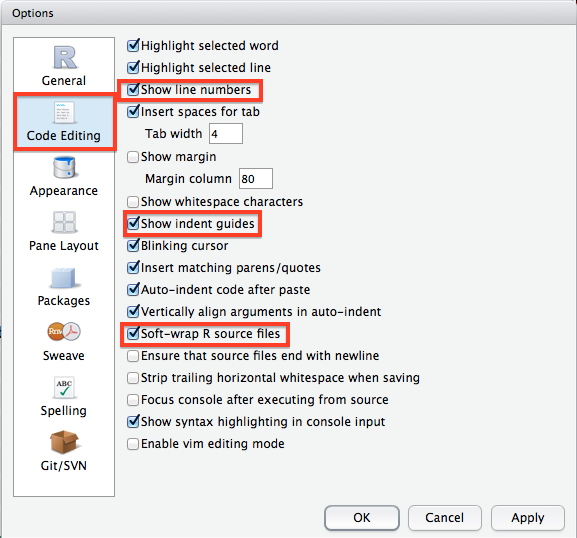

6. Another useful feature of RStudio not found in the Options window is its integrated help window. On my setup, this can be found by clicking on the **Help** tab in the bottom right pane. In the top right of the help window there is a search bow where you can type in a function name and RStudio will display a bunch of useful information including a description of the function, its usage and arguments which you will need to actually use it in you own code, and all the way at the bottom there will be working examples which are often really helpful!  
  
  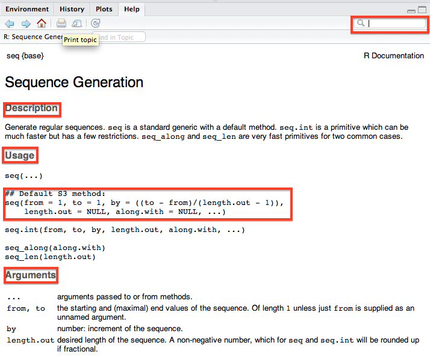

7. One other really useful feature of RStudio is the Run button, which much like its Stata counterpart, allows you to run a selected line or lines of code from your script file without having to copy the code into the console. You can also do this by using **Control + Enter** with text in the script file highlighted (Windows/ Linux) or **Command + Enter** (Mac). These are huge time savers.   
  
  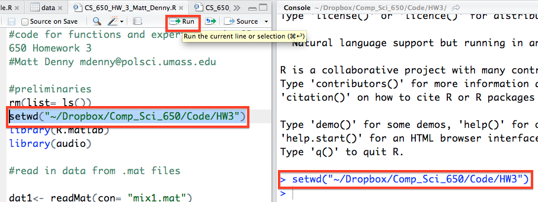

8. Before you go off coding your brains out, you will need to be able to create a new R script file, which you can do from  the top left corner of the **Source** pane and then by selecting **R Script**. You will then want to immediately save this file which can be done by going to the file menu or by clicking on the floppy disk icon right next to the new file icon (which will only become active and light up when you have unsaved changes to the current script).   
  
  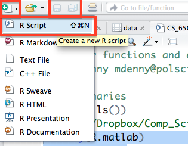

9. The environment pane is probably the single most useful feature of RStudio. It lets you see a visual representation of all of the variables and objects you have currently stored in memory. For the objects in the **Data**  and **Values** tabs with a little blue arrow next to them, you can click on them and they will appear in spreadsheet form over in your **Source** pane so you can actually see the values. You can also see the variable type  (character, integer, numeric, etc.) of a variable, vector, matrix, etc. which can be very useful in diagnosing problems with your data (for example numbers being read in as characters -- which the regression functions in R do not like!).   
  
  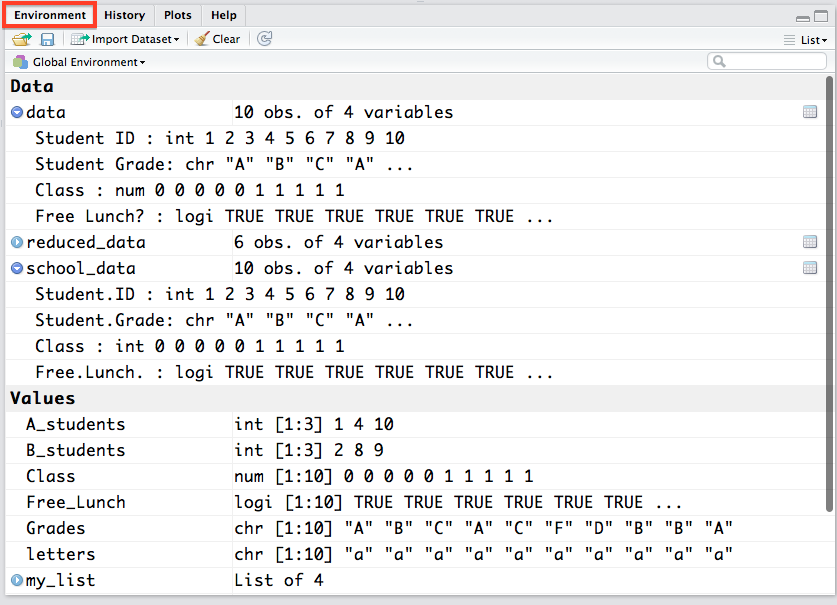

10. One other very important thing you will need to do in RStudio is set the location where it should search for packages before you download them. In the **Options** window, go to the **Packages** tab, click change under the **CRAN mirror** heading and select either **USA(MD)** or **USA(MI)}** (I find these work best for the east coast). Then click **OK** and then **Apply**. This will make sure that R knows where to look for packages when you ask it to download them.
      
 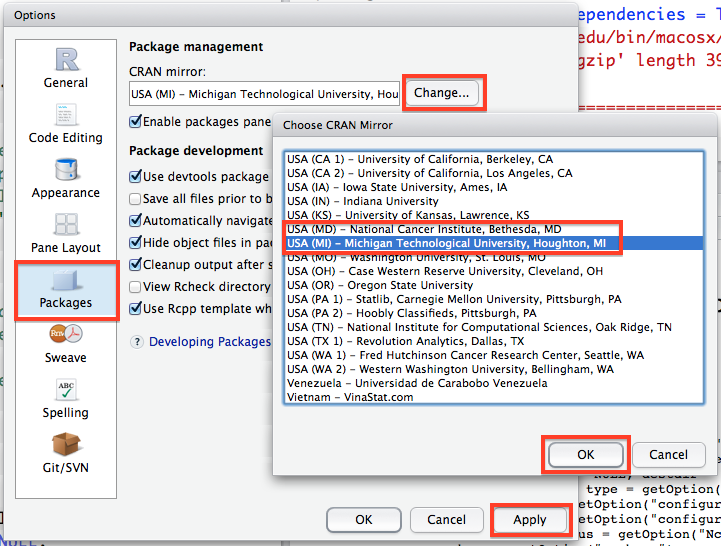

## Github

**Git** is a form of version control, which allows you to track changes you make to your R code (or any files for that matter), for free, and it makes collaborating waaayyy easiier because it helps you resolve conflicts if you and a coauthor try to edit the same thing at the same time. For more on why you should use Git, check out [this page](http://www.git-tower.com/learn/git/ebook/mac/basics/why-use-version-control).   
  
You should start by going to <https://github.com/> and creating an account. You will want to include an up-to-date email address, a link to your academic website (if you have one), and generally keep your profile nice and clean -- after all, this is a public site you are putting forward.  
  
Once you have a GitHub account set up, you will want to start by installing Git on the computer you are using. This can be done pretty easily by Googling "install git on [my OS]", but I will give some pointers here just for good measure. You should definitely spend the 15 minutes necessary to read [this tutorial](https://guides.github.com/activities/hello-world/) by the folks at gihub first though. If you have a Mac or Windo ws machine, there are perfectly good GUIs available -- [here for mac](https://mac.github.com/), and [here for windows](https://windows.github.com/) and you should just use one of those. I will provide some notes on using the Mac github client (which I use most often) and then a tutorial on the commandline version for Linux. As far as I know, the windows version of the Github client should work just as well as teh Mac version does.

### Mac

The Github client is a really well designed program. Once you have downloaded and installed it, try opening the application up.

1. Once you have the application open, you can go ahead and create your first **repo**!  You will want to click on the **+** button on the top left corner of the application screen and select the **Create** tab. You will then want to select the name of your repo (as it will appear on GitHub -- you can always change it later). You will then want to select a local path. As the application notes, Dropbox/Google Drive folders can corrupt your repo, but if you are mostly just working on it yourself, this should not be a problem (many of my repos are stored locally on my computer)

 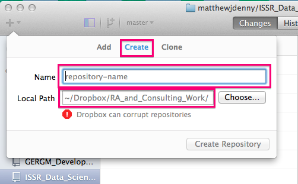

2. If you already started a repo using the builtin utility in RStudio, or just have an existing folder you would like to turn into a Git repo, you can add it to the list of repos you can interact with in the program using the **Add** tab, by specifying the folder.   
  
 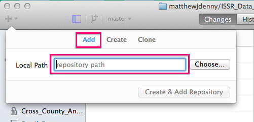

3. Once you have set up your repo, you can now make **commits** (document your changes) to it as you edit or add files to the local folder associated with the repo. You will see changes show up as file names with a checkbox next to them as you make the changes. you can use the same commit message for multiple files or a different one for each. I generally try to make sure that the messages are specific so that it is possible to tell when I made what changes so I only select those files to commit together where the changes are all similar (say I renamed an R variable in three scripts, I would make one commit with the message "Changed variable name from X to Y"). You can see the changes i nthe file by looking for line-wise insertions (highlighted in green) and  deletions (highlighted in red) in the pane on the right. Once you have typed your commit message, click the **Commit to master** button.

 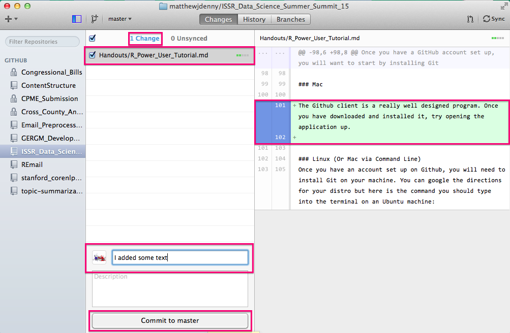

4. After each commit, you will have a chance to undo it (to make further changes or change the message) and you will see the **Changes** counter on the top decrease by the number of files you committed and the **Unsynced** counter increase. 
  
  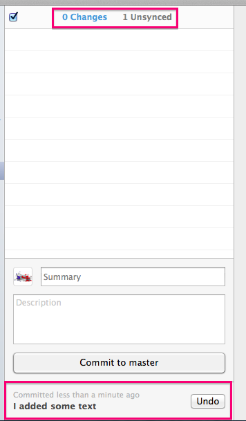

5. Before you **Push** your changes up to GitHub (adding a commit only stores it locally, not on the web), you can click on the  **Unsynced** counter to see the commits you are about to sync up to the internet.   
  
 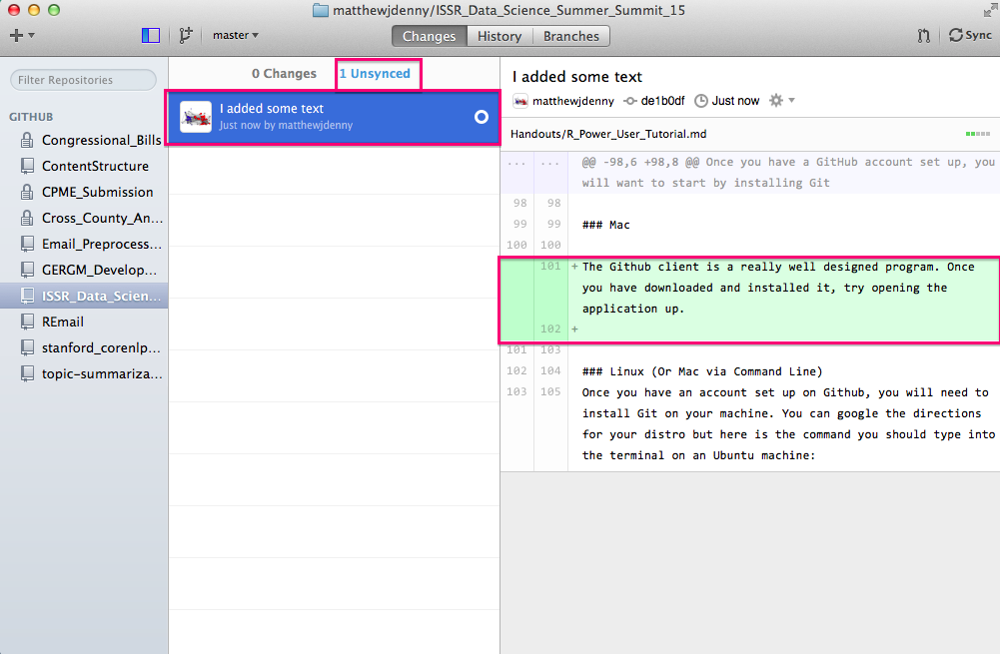

6. Now you can click on the **Sync** button on the top right of the window and this will **Push** all of your changes up to your Github website. Note that if you have collaborators who are working on the project with you, or if you made changes to the repo online, you will want to hti the **Sync** button on your local machine before working more on yout computer, as those changes will not show up until you hit sync. It is good to get int oa habit of always doing this before you work on a project that is linked up to Git.
  
  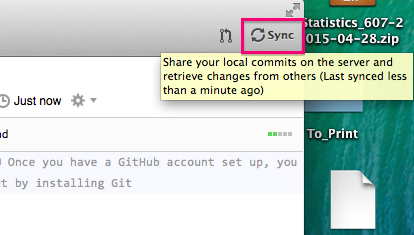

7. You can also check out the history of commits (both local and remote) by clickijng on the **History** tab in the top middle of the screen. This will show you commit messages and all changes to all documents since the repo was started, very useful for following your workflow.   
  
  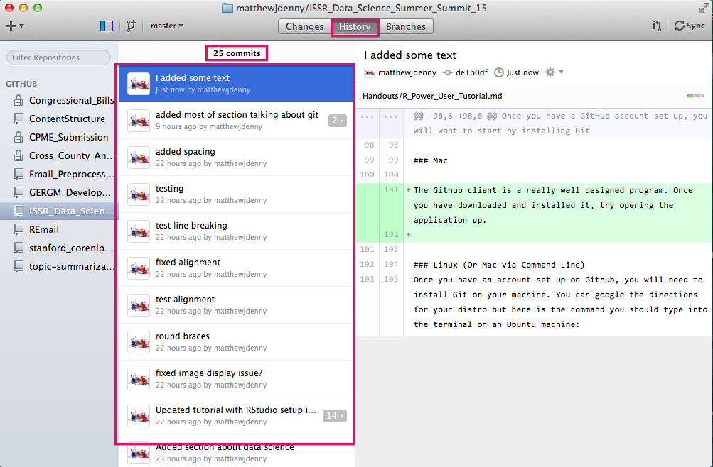

8. Speaking of collaborators, you can add them to the project by clicking on the **Settings** tab on the bottom right of the github page for your repo, and then selecting the **Collaborators** tab and searching for the collaborator by github name (they will have to have an acount). They will then be able to make edits to your project. By default, other people will be able to look at what you have done (repos are "public") but only collaborators will be able to edit. 
  
   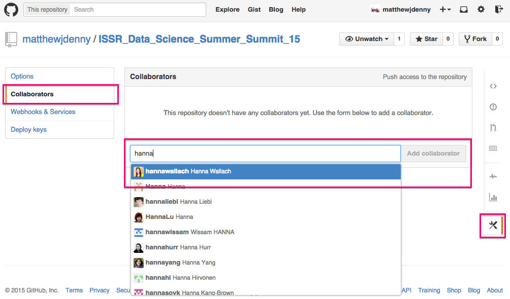   
   
9. If you want to set up a **private** repo for a paper or something you do not want to be public, you can apply for an academic discount on 5 private repos here -- <https://education.github.com/>, just make sure your academic email address is your primary address. I got rejected the first time but when I wrote back they set me up so now I can work on papers privately for free!

### Linux (Or Mac via Command Line)
Once you have an account set up on Github, you will need to install Git on your machine. You can google the directions for your distro but here is the command you should type into the terminal on an Ubuntu machine:

    sudo apt-get install git-core
	
And here are the commands for installing on a CentOS machine (if you already have `yum` installed -- which you should):

    sudo yum install git

Unfortunately, the GUI options for linux are much mroe limited and depend on your distro so I will jsut show you the command line version. Once Git is installed on your Linux machine, open up a terminal and `cd` to your home directory. Then type in:

	git config --global user.name "your-name"
	git config --global user.email "your-email"

Now set up git to use SSH by generating a public key:

	ssh-keygen -t rsa -b 2048 -N ""
	cat ~/.ssh/id-rsa.pub.
	
Go to Github to your user settings, click on the SSH tab and add your key. Now `clone` the repo you want to use (assuming you have already created it on Github, which is advisable the first time around) by `cd`ing to the place where you want to clone the directory to and then:

	git clone git@github.com:YOUR_USERNAME/YOUR_PROJECT.git

You will also need to change the way you `push` to use `ssh` instead of `https`. To do this you will need to alter the `.git/config` file in the directory where your project is located by changing the url line in a manner analogous to the example below and then saving the file:

	cd /pathToYourLocalProjectFolder
	gedit .git/config

now change the line that looks like this:

	url=https://github.com/matthewjdenny/example.git 

to make it look like this:

	url=ssh://git@github.com/matthewjdenny/example.git 

Once you have done that, here are the commands you need to `pull`, `commit` and `push`:

	# pull
	cd /pathToYourLocalProjectFolder
	git pull origin master  
	  
	# commit
	git add .
	git commit -m "type your commit message here"  
	  
	#push -- note you should pull first to prevent any errors
	git pull origin master
	git push origin master

## Naming Conventions

A good practice to get into is using very descriptive file names for all of your R projects. This will help you out a lot if you have to come back to a project you started several years ago to find some analysis, or if you want to share your code. When defining functions it is also generally a good idea to define one per .R script, and name the function identically to the file. I have found that for each project I tend to include the following folders in the top level directory:

* **/scripts** -- a folder where I keep all of the scripts that perform my anamysis or major data management tasks. 
* **/functions** -- A folder to keep helper files and user defined functions. Could also put any C++ sorce files in here, or put them in their own directory.
* **/raw_data** -- A directory to hold the raw data you collect, separate from the .Rdata files with the data you actually pan to analyze. This will keep it safe from inadvertintly being overwritten. 
* **/data** -- A directory where you keep the data files you will actually use for analysis.
* **/backups** -- You should be using Git, but before you submit to a conference or journal, jsut put everything relevant in a .zip file and store it with the date incase you need to come back to exactly the way things were.
* **/paper** -- Where you keep the paper nad any presentation .tex source (or Word docuemnts if you roll that way).
* **notes.txt** -- A file where you keep track of things that happen durring the project or anything you might forget that woudl be necessary to replicate or explain your work.

You will also want to stick to a common format for naming variables and functions. Here are the three most common formats -- just pick one!

	myNewVariable
	my_new_variable
	my.new.variable (may not work for file names)

You may also want to capitalize the first letter of each word, this is up to you. Sticking to a common set of formatting and naming convertions will help you be more productive and prevent mistakes, so it is worth the investment up front!

## Remote Access

As you dive into larger scale Data Science projects, the computational tasks you need to do will likely become more resource intensive. This means that any particular task may require more memory (to hold a larger dataset) and/or more time to compute. While the average laptop today can actually handle quite a lot of computing tasks, often pretty speedily, you may want to have access to a desktop computer, workstation, or server, for the sake of stability (these things do not come unplugged) and increased muscle (more RAM/processors). While this works out wuite well if you are able to sit infront of the desktop all day, often times you will find yourself wanting access even when you are not right infront of the computer. This is where remote access comes in. If your comptuer is connected to the internet, you can access it remotely from anywhere that has internet access.  
  
  
Setting up computer infrastructure to gain access and control of a computer from a different location is the more standard definition of **Remote Access**, and for a number of problems is something you may want to do. As an example, you may have a program you want to run, but do not know exactly when it will complete. If the computer is in a location that might take some effort to get to, going to check on it every day might become cumbersome. In this case, you will want to set up remote access to that computer so you can check on things from your laptop. The more typical need most people have for remote access is when the computer they need to use is in a location they do not have physical access to. This is the case for the UMass cluster computing resources at MGHPCC. In this situation, your ability to access the computer remotely will determine whether you can use it at all.   

  
This section will outline the two main methods of gaining remote access to a computer over the internet, detail how you can set up Windows, Mac and Linux machines to accept remote access and control, and provide resources for gain access to and using the UMass cluster computing resources at MGHPCC.

###Allowing Remote Access to a Computer

Computer operating systems do not allow just anyone to gain control of a computer over the internet by default. This is to prevent Russian hackers from turning your computer into a spam bot. Yet if you have a desktop, you may want to make it available to access from anywhere for you and only you. You will need to take two steps to do this-- the first is giving your computer an address where it can be found, the second is configuring your computer to allow access. The first step can be accomplished in one of two ways: 

1. If you are a faculty member or can demonstrate a real need for one, OIT may grant you a static IP address. This is a constant, unchanging address for your computer that will allow you to contact it from anywhere in the world easily. This is a valuable resource for the university as they only have a limited number, but they are willing to make them available. You can email <hostmaster@oit.umass.edu> to inquire about getting a Static IP address. They will need a bunch of information about your computer but are good at explaining what they need. Note that this strategy will only work if your computer is stored on campus and comes with some added security challenges as a Static IP address will make you a target for hacking. That said, this is the gold standard and the best option if you can get it. 
2.  The second option, which will work anywhere, is to use a dynamic DNS service like [DynDNS](http://dyn.com/remote-access/). It costs $25 a year, but will allow you to assign a unique identifier to your computer that will be continually updated as your computer's IP address changes (which it naturally does). This option should keep you safe from most major security threats and will let you login to a home computer but most reputable services cost something (I use DynDNS).  They have pretty good directions on their website so just follow them when you sign up and you should be ready to go in a few minutes.

Once you have secured a static or dynamic IP address, you now need to allow access to your computer. This is detailed for different operating systems below:

1. In windows this is pretty straightforward, you just navigate to **Control Panel --> System Properties --> Remote** and check the box as shown below. There is a more detailed tutorial for doing this available [here](http://www.howtogeek.com/howto/windows-vista/turn-on-remote-desktop-in-windows-vista/)  
  
  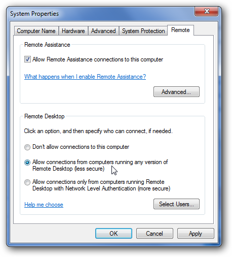
  
2. On a Mac desktop, follow the directions on the following links (Maverics)-- [for ssh](http://support.apple.com/kb/PH13759) and  [for RDP](http://support.apple.com/kb/PH14130). 
3. Ubuntu and all Linux distros more generally also make things dead easy, and generally allow the most flexibility in accessing them. Check out [this tutorial](http://www.makeuseof.com/tag/ubuntu-remote-desktop-builtin-vnc-compatible-dead-easy/)

Once you have done this you should be ready to go. One thing to note if you are using a home computer and you have a router with a firewall, you may need to configure port forwarding to allow connections through your firewall. This may be a bit challenging so you will need to consult the internet for help with you particular router.

###Adding Security for A Static IP
If you have a Windows machine with a static IP, you should be alright and should not spend time worrying about security threats due to remote access being turned on. This is also because it is much more difficult to do something about it if you are using Windows because it does not have as nice of a command line interface. If you are using a Linux machine with a static IP located on campus, criminals will start to ping your machine to try and guess your password to login and gain remote control of your computer. This can be very bad. Fortunately you can do something about it that will make your computer totally safe -- you can restrict access to your computer to IP address on the UMass network. If anyone is stupid enough to try to hack your computer from the campus network, OIT will catch them (they are watching for this activity 24/7 and they take severe disciplinary action including expulsion if it is a student (which they can do because they know the identity of every user).   
  
The following directions are written for CentOS 6 and may need to be modified for your Linux distro, but all you will need to do is look up the location of your iptables file. Open up a new terminal and type in the following (or equivalent on your system)

	sudo vi /etc/sysconfig/iptables

This should open up a file that looks something like this in the vi editor (for a tutorial on using vi, check out [this website](http://staff.washington.edu/rells/R110/))

	# Firewall configuration written by system-config-firewall
	# Manual customization of this file is not recommended.
	*filter
	:INPUT ACCEPT [0:0]
	:FORWARD ACCEPT [0:0]
	:OUTPUT ACCEPT [0:0]
	-A INPUT -m state --state ESTABLISHED,RELATED -j ACCEPT
	-A INPUT -p icmp -j ACCEPT
	-A INPUT -i lo -j ACCEPT
	-A INPUT -m state --state NEW -m tcp -p tcp --dport 443 -j ACCEPT
	-A INPUT -m state --state NEW -m tcp -p tcp --dport 22 -j ACCEPT
	# you will be inputting your new rules here!
	-A INPUT -j REJECT --reject-with icmp-host-prohibited
	-A FORWARD -j REJECT --reject-with icmp-host-prohibited
	COMMIT

You will need to copy the following chunk of code into the  iptables file in the position marked above. This will set your computer to only allow udp and tcp connections from the UMass IP block. The first four lines set up a nonstandard port number, this can make you even harder to find. Note that this is not supported by OIT, but people who work there do this themselves.

	-A INPUT -m state --state NEW -m udp -p udp -s 128.119.0.0/16 --dport 32576  -j ACCEPT
	-A INPUT -m state --state NEW -m udp -p udp -s 72.19.64.0/18 --dport 32576 -j ACCEPT
	-A INPUT -m state --state NEW -m tcp -p tcp -s 128.119.0.0/16 --dport 32576  -j ACCEPT
	-A INPUT -m state --state NEW -m tcp -p tcp -s 72.19.64.0/18 --dport 32576 -j ACCEPT
	-A INPUT -m state --state NEW -m udp -p udp -s 128.119.0.0/16 --dport 5900 -j ACCEPT
	-A INPUT -m state --state NEW -m udp -p udp -s 72.19.64.0/18 --dport 5900 -j ACCEPT
	-A INPUT -m state --state NEW -m tcp -p tcp -s 128.119.0.0/16 --dport 5900 -j ACCEPT
	-A INPUT -m state --state NEW -m tcp -p tcp -s 72.19.64.0/18 --dport 5900 -j ACCEPT

Once you have saved your changes, type in the following commands into your console to restart your iptables with the new settings enabled. You will want to test that this worked by trying to login from outside the UMass network.

	service iptables restart

You should now be pretty safe from outside intrusion. To login from outside the Umass network you will need to use a VPN that will fool your computer into thinking you are on the UMass network. You can set up a VPN by going to [this website](http://www.oit.umass.edu/vpn). You will also need to get in touch with OIT and have VPN added to your account services.

###Command Line
You can connect to a remote computer very easily and extremely securely using SSH (Secure SHell). However, this requires you to know how to use Bash or whatever command line environment your OS uses. This is a hugely valuable skill, but not the focus of this tutorial. There are a ton of resouces for learning Bash and SSH on the internet. A few of them are listed here:

1. A nice tutorial from [Wikihow](http://www.wikihow.com/Use-SSH).
2. A whole bunch of tutorials in SSH and ways of copying files to and from your remote computer using  FTP  and SCP from [siteground](http://www.siteground.com/tutorials/ssh/).
3. An example connecting using SSH from Mediatemple is available [here](http://kb.mediatemple.net/questions/16/Connecting+via+SSH+to+your+server#gs).
4. Some common pitfalls people run into while programming in Bash and [fixes](http://mywiki.wooledge.org/BashPitfalls}{http://mywiki.wooledge.org/BashPitfalls)

Most clusters are only accessible over SSH so this is the way to go in terms of learning a new skill that you can translate into bigger problems in the future. 

###RDP and VNC

Remote Desktop Protocol (**RDP**) and Virtual Network Computing (**VNC**) are two protocols for connecting to your computer that will give you a window that looks just like you were sitting in front of the computer screen. It makes remote computing dead easy but requires a faster internet connection so is not always ideal when traveling. That said it is good for many quick tasks. Windows and Linux both have free clients for accessing another computer but I really think a paid client is worth  the $20 or less you spend on it. I use JumpDesktop for logging  in to my personal cluster and have found it to be fast and easy to set up. It is also free for windows and is available here: <http://jumpdesktop.com/>. If you go this route there is not much more to explain. You simply use the remote computer as if you were sitting right in front of it and  do whatever you need to do. A note of caution though -- this does not build any skills and will mean that if you need to run your analysis on a bigger cluster, you will have to learn SSH anyway. 

###Setting Up Access to Your Campus Cluster

The first thing you need to do to get access to a cluster is determine whether your university/organization even has a cluster resource available. You will want to find the associated web page and contact someone listed as an administrator before you go any further to ask them if you can have access and how you would go about doing that. You may have to get faculty sponsorship, pay a fee, or just fill out a form. You will also have to do a fair bit of research to learn about the norms and rules of using your local cluster. Additionally, each cluster will have its own job scheduling software. This software provides the administrators with a way to ensure that resources are distributed fairly across users and that users can request an appropriate amount of resources. You will need to consult the help page for the job scheduler/cluster you are using as there are more different languages than I can possibly go into here. What follows is just an illustrative example (with helpful links) for logging in to the UMass cluster resource to get you started with how you might go about doing the same at your home university.   
  
UMass Amherst currently owns and maintains a 10,000+ core cluster with 50+ TB RAM and 400+ TB Shared high performance storage as part of the Massachusetts Green High Performance Computing Center (**MGHPCC**), located in Holyoke, MA  <http://www.mghpcc.org/>. This cluster is available to UMass Faculty and Graduate students for HPC use and has a fairshare job queue that allows researchers who have not purchased their own cluster resources to use it as well. Current costs for buy-in are around $100k for a 512 core AMD rack. What follows are instructions for getting started with setting up an account and submitting simple jobs in **R**. 

1. If you are a Principal Investigator (UMass Faculty), simply go to [this page](https://www.umassrc.org/hpc/) and fill out the form, you should be granted an account within a week. If you are a graduate student, you need to get your adviser to make an account first (or find a faculty member who is willing to be your PI), have them create an account and then list them as your PI when you make an account request.
2. MGHPCC only allows connections from the UMass campus network so if you want to connect from your laptop off campus, you will need to do so through a virtual private network (**VPN**) that essentially routes all of your internet traffic through an encrypted tunnel to the UMass network. You can set up a VPN by going to [this website](http://www.oit.umass.edu/vpn). You will also need to get in touch with OIT and have VPN added to your account services. If you are not approved for some reason, you will just be limited to accessing the cluster while you are physically on campus. 
3. Once you have an account set up, you will have to use **ssh** to login to the cluster remotely. If you have a Mac or Linux machine you will have this available by default, but if you are on Windows you will need to install PUTTY by clicking on the following [link](http://www.chiark.greenend.org.uk/~sgtatham/putty/). Once you have Putty installed (if you are working in Windows) you can click on the icon to open a PUTTY terminal. If you are using a Mac/Linux computer, simply open a terminal. In either case, you can now type the following into your terminal, which should then prompt you for a password if you are successful:   
  
      	ssh username@ghpcc06.umassrc.org 

	    
    Once you have successfully logged in, you can change directory to your home directory:   

		
       	cd /home/username   
		  
	You can now copy files over using scp and then submit jobs to the cluster using LSF. A detailed tutorial for this entire process is linked to as the next item on this list.
4. For a nice tutorial on how to login and submit jobs to the MGHPCC presented by Andrea S Foulkes, Gregory J Matthews, Nicholas G Reich as part of an ICB3 Big Data workshop, follow [this link](http://www.beyondeconomy.net/Files/ICB3_MGHPCC_Login_Slides.pdf)

